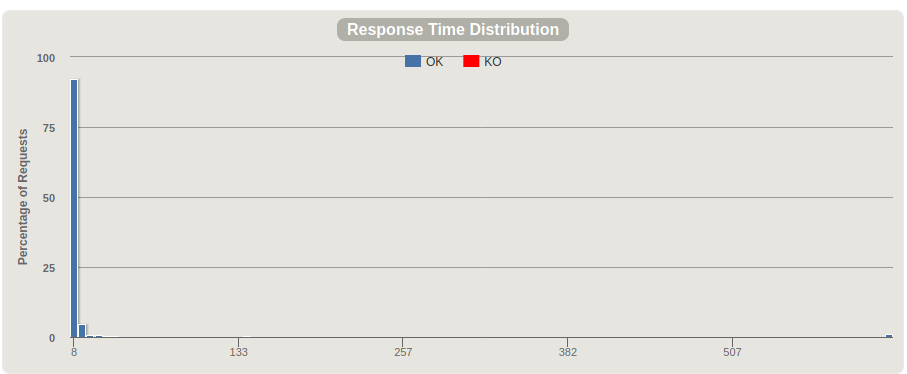
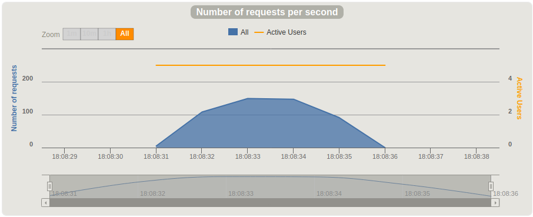
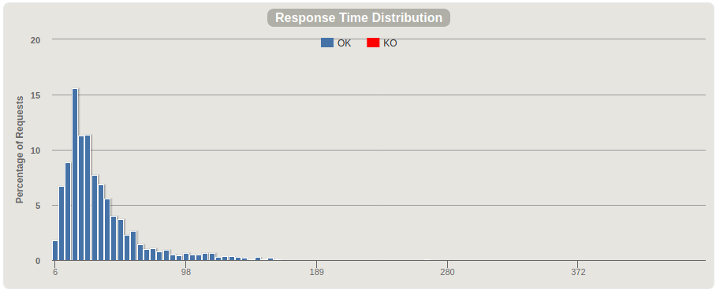
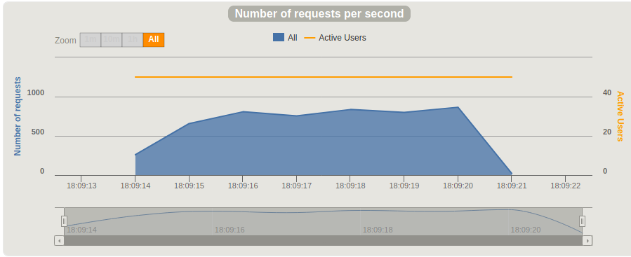
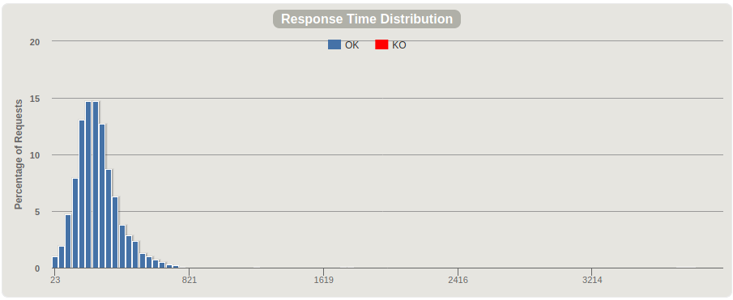
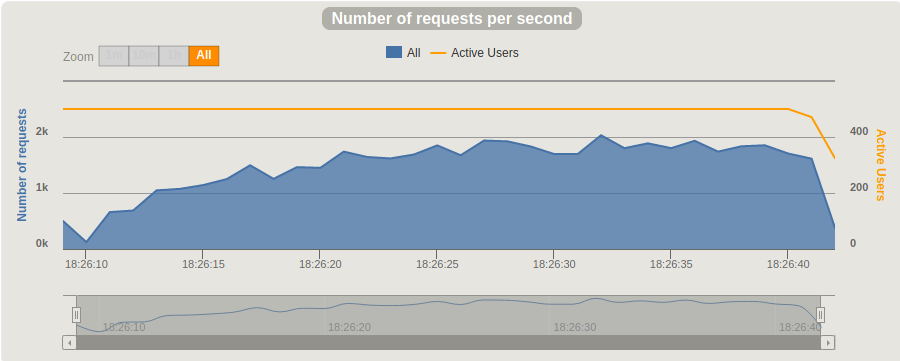

# Pencroff
A meta-indexer for blockchains

Named after Bonadventure Pencroff from https://en.wikipedia.org/wiki/The_Mysterious_Island.

# Development quickstart instructions

1. Add scala project at `<root>/ingestor` to IntelliJ. The usual steps of importing a project apply.
1. Goto docker/kudu and edit the two shell scripts. Set your machine's local ip (The one assigned by your router) there. `start.sh` opens ports in the firewall that are required for database start up using `iptables`. Replace these commands with your favorite FW manager if so required.
1. Run `start.sh` to start kudu.
1. Open `<root>/ingestor/src/main/resources/reference.conf` in an editor. Set the `host`, `port` and `protocol` config items to point to a tezos node of your choice. Edit nothing else.
1. In IntelliJ, run `BlockIngestor.scala`. It should automatically create the necessary tables and start ingesting data from the node you specified in the previous step.
1. After a while in IntelliJ, run `DataServer.scala`. This runs a HTTP server that mimics the node's api. Note that all urls to this have a prefix to them, currently hard coded to `tezos`.
1. Open postman, run the following queries `localhost:8080/tezos/chains/main/blocks/0` and `localhost:8080/tezos/chains/main/blocks/BLockGenesisGenesisGenesisGenesisGenesisd6f5afWyME7`. You should see identical output from these. Compare to the output from your configured tezos node. If everything matches you are good to start developing.

# Early Load Test Results

No suitable Tz node was available to test against. Pencroff results follow:

Notes:
1. All tests peformed locally.
1. Each simulated user runs 100 queries, each fetching a random block between 0 and 350.
1. After each fetch, the simulated user waits for 25 milliseconds before querying again.
1. Kudu cluster is running dockerized inside a virtual machine.
1. VM has 8 gigs, 8 virtual CPU cores, running ArchLinux, kernel 5.7.6.
1. X axis on response time graphs is milliseconds.
1. No errors whatsoever were reported during any of the tests.

### TLDR Summary
1. Sub second response across all tests
1. Average RPS on 500 User test is 1470 Request / Second. *This, naively, and very incorrectly, gives us an upper bound of around 127 mil requests / day*.

### 5 Users / 100 Queries each

### 50 Users / 100 Queries each

### 500 Users / 100 Queries each

